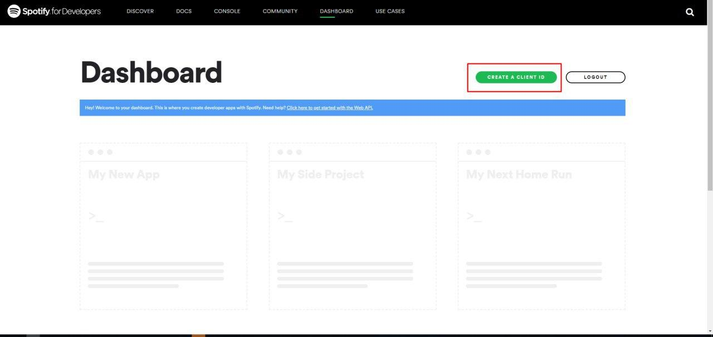

# Spotify saved tracks update

This script creates and updates a public Spotify playlist containing the last 50 saved tracks from the user's library.

## Dependencies

[Spotipy](https://github.com/plamere/spotipy)

## Usage

```python3 main.py [username]```

The script will ask for client\_id, client\_secret and redirect\_uri, which you can get from the [Spotify Developer Console](https://developer.spotify.com/dashboard/)

Create a Client ID:



Click on Edit settings:


Add Redirect URIs:


Copy your credentials:


